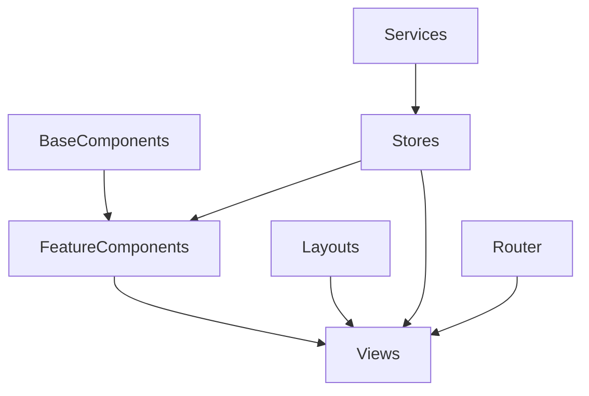

# Vue Frontend Component Structure

This document outlines the component structure for the Loan Application System V2 frontend implementation.

## Component Organization

The frontend components are organized by feature and type:

```
src/
├── components/
│   ├── common/           # Shared UI components
│   ├── application/      # Application-specific components
│   ├── borrower/         # Borrower-specific components
│   ├── broker/           # Broker-specific components
│   ├── document/         # Document-specific components
│   ├── notification/     # Notification-specific components
│   └── ...               # Other feature-specific components
```

## Common Components

These components are shared across multiple features:

### UI Components

| Component | Description | Status |
|-----------|-------------|--------|
| `BaseButton.vue` | Customized button component | Pending |
| `BaseCard.vue` | Card component with consistent styling | Pending |
| `BaseTable.vue` | Reusable data table with sorting and filtering | Pending |
| `BaseForm.vue` | Form wrapper with consistent styling | Pending |
| `BaseInput.vue` | Input field with validation | Pending |
| `BaseSelect.vue` | Select dropdown with consistent styling | Pending |
| `BaseCheckbox.vue` | Checkbox with consistent styling | Pending |
| `BaseRadio.vue` | Radio button with consistent styling | Pending |
| `BaseSwitch.vue` | Toggle switch with consistent styling | Pending |
| `BaseModal.vue` | Modal dialog with consistent styling | Pending |
| `BasePagination.vue` | Pagination component | Pending |
| `BaseAlert.vue` | Alert component for notifications | Pending |
| `BaseChip.vue` | Chip component for tags and status indicators | Pending |
| `BaseAvatar.vue` | Avatar component for user profiles | Pending |
| `BaseIcon.vue` | Icon wrapper with consistent styling | Pending |

### Layout Components

| Component | Description | Status |
|-----------|-------------|--------|
| `PageHeader.vue` | Page header with title and actions | Pending |
| `PageContainer.vue` | Page container with consistent padding | Pending |
| `SectionDivider.vue` | Section divider with optional title | Pending |
| `TabNavigation.vue` | Tab navigation component | Pending |
| `Breadcrumbs.vue` | Breadcrumb navigation | Pending |
| `ActionBar.vue` | Action bar with buttons | Pending |
| `FilterBar.vue` | Filter bar for tables | Pending |
| `SearchBar.vue` | Search input with suggestions | Pending |

### Form Components

| Component | Description | Status |
|-----------|-------------|--------|
| `FormSection.vue` | Form section with title and description | Pending |
| `FormActions.vue` | Form action buttons (save, cancel, etc.) | Pending |
| `FormRow.vue` | Form row with label and input | Pending |
| `FormError.vue` | Form error message | Pending |
| `FormHelp.vue` | Form help text | Pending |
| `FormValidationSummary.vue` | Summary of form validation errors | Pending |
| `AddressForm.vue` | Address input form | Pending |
| `DatePicker.vue` | Date picker component | Pending |
| `FilePicker.vue` | File upload component | Pending |
| `MoneyInput.vue` | Currency input with formatting | Pending |
| `PhoneInput.vue` | Phone number input with formatting | Pending |
| `PercentageInput.vue` | Percentage input with formatting | Pending |

## Feature-Specific Components

### Application Components

| Component | Description | Status |
|-----------|-------------|--------|
| `ApplicationCard.vue` | Card displaying application summary | Pending |
| `ApplicationStatusBadge.vue` | Badge showing application status | Pending |
| `ApplicationFilter.vue` | Filter for application list | Pending |
| `ApplicationForm.vue` | Form for creating/editing applications | Pending |
| `ApplicationTimeline.vue` | Timeline of application status changes | Pending |
| `ApplicationNotes.vue` | Notes section for applications | Pending |
| `ApplicationDocuments.vue` | Documents section for applications | Pending |
| `ApplicationFees.vue` | Fees section for applications | Pending |
| `ApplicationRepayments.vue` | Repayments section for applications | Pending |
| `ApplicationCalculator.vue` | Loan calculator for applications | Pending |
| `ApplicationWorkflow.vue` | Workflow actions for applications | Pending |

### Borrower Components

| Component | Description | Status |
|-----------|-------------|--------|
| `BorrowerCard.vue` | Card displaying borrower summary | Pending |
| `BorrowerFilter.vue` | Filter for borrower list | Pending |
| `BorrowerForm.vue` | Form for creating/editing borrowers | Pending |
| `BorrowerApplications.vue` | List of borrower's applications | Pending |
| `BorrowerDuplicateCheck.vue` | Duplicate detection for borrowers | Pending |
| `BorrowerMerge.vue` | Interface for merging duplicate borrowers | Pending |
| `GuarantorForm.vue` | Form for creating/editing guarantors | Pending |

### Broker Components

| Component | Description | Status |
|-----------|-------------|--------|
| `BrokerCard.vue` | Card displaying broker summary | Pending |
| `BrokerFilter.vue` | Filter for broker list | Pending |
| `BrokerForm.vue` | Form for creating/editing brokers | Pending |
| `BrokerApplications.vue` | List of broker's applications | Pending |
| `BrokerBorrowers.vue` | List of broker's borrowers | Pending |
| `BrokerCommissions.vue` | Commission tracking for brokers | Pending |
| `CommissionPaymentForm.vue` | Form for recording commission payments | Pending |

### Document Components

| Component | Description | Status |
|-----------|-------------|--------|
| `DocumentCard.vue` | Card displaying document summary | Pending |
| `DocumentFilter.vue` | Filter for document list | Pending |
| `DocumentUpload.vue` | Document upload interface | Pending |
| `DocumentPreview.vue` | Document preview component | Pending |
| `DocumentGenerate.vue` | Document generation interface | Pending |
| `DocumentTemplateForm.vue` | Form for creating/editing document templates | Pending |
| `DocumentVersionHistory.vue` | Version history for documents | Pending |
| `DocumentSigningRequest.vue` | E-signature request interface | Pending |

### Notification Components

| Component | Description | Status |
|-----------|-------------|--------|
| `NotificationList.vue` | List of notifications | Pending |
| `NotificationItem.vue` | Individual notification item | Pending |
| `NotificationBadge.vue` | Badge showing unread notification count | Pending |
| `NotificationSettings.vue` | Settings for notifications | Pending |
| `NotificationTemplateForm.vue` | Form for creating/editing notification templates | Pending |
| `NotificationPreview.vue` | Preview for notification templates | Pending |

## Dashboard Components

| Component | Description | Status |
|-----------|-------------|--------|
| `SummaryCard.vue` | Card displaying summary statistics | Completed |
| `ApplicationChart.vue` | Chart for application statistics | Completed |
| `RecentApplications.vue` | Table of recent applications | Completed |
| `ReminderList.vue` | List of reminders | Completed |
| `TaskList.vue` | List of tasks | Pending |
| `PerformanceMetrics.vue` | Performance metrics display | Pending |
| `StatusDistribution.vue` | Distribution of application statuses | Completed |
| `MonthlyTrends.vue` | Monthly trends chart | Completed |

## Admin Components

| Component | Description | Status |
|-----------|-------------|--------|
| `UserList.vue` | List of users | Pending |
| `UserForm.vue` | Form for creating/editing users | Pending |
| `RoleList.vue` | List of roles | Pending |
| `RoleForm.vue` | Form for creating/editing roles | Pending |
| `PermissionList.vue` | List of permissions | Pending |
| `PermissionForm.vue` | Form for creating/editing permissions | Pending |
| `AuditLog.vue` | Audit log display | Pending |
| `SystemSettings.vue` | System settings interface | Pending |

## Component Dependencies



## Component Design Principles

1. **Single Responsibility**: Each component should have a single responsibility
2. **Reusability**: Components should be designed for reuse where possible
3. **Composability**: Complex components should be composed of simpler components
4. **Consistency**: Components should follow consistent naming and styling conventions
5. **Accessibility**: Components should be accessible to all users
6. **Performance**: Components should be optimized for performance
7. **Testability**: Components should be designed for easy testing

## Next Steps

1. Implement base UI components
2. Create feature-specific components
3. Integrate components into views
4. Add unit tests for components
5. Document component API and usage examples
